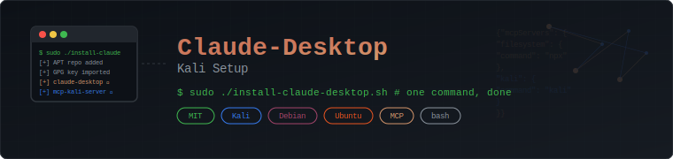

# Claude-Desktop-Kali-Setup

<p align="center">
  
</p>

One-command installer for Claude Desktop + MCP servers on Kali/Debian/Ubuntu.

**Author:** [SkyzFallin](https://github.com/SkyzFallin)

## What It Does

The install script handles everything needed to get Claude Desktop running with MCP server integration on Debian-based Linux:

- Adds the official Claude Desktop APT repository (`https://claude.ai/debian/`) and imports the GPG signing key
- Installs `claude-desktop` and `mcp-kali-server` with required bootstrap dependencies (`ca-certificates`, `curl`, `gnupg`)
- Generates the MCP configuration at `~/.config/Claude/claude_desktop_config.json` with two servers pre-configured:
  - **Filesystem MCP** — gives Claude access to read/write files in your home directory
  - **Kali MCP** — exposes Kali Linux security tools to Claude for interactive use

### What Gets Configured

The installer creates this MCP config automatically:

```json
{
  "mcpServers": {
    "filesystem": {
      "command": "npx",
      "args": ["-y", "@modelcontextprotocol/server-filesystem", "<your-home-directory>"]
    },
    "kali-mcp-server": {
      "command": "python3",
      "args": [
        "/usr/share/mcp-kali-server/mcp_server.py",
        "--server",
        "http://127.0.0.1:5000/"
      ],
      "description": "Kali MCP Server",
      "timeout": 300
    }
  }
}
```

## Quick Start

```bash
git clone https://github.com/SkyzFallin/claude-desktop-kali-setup.git
cd claude-desktop-kali-setup
sudo ./install-claude-desktop.sh
```

## After Installation

Start the Kali API server:

```bash
kali-server-mcp
```

Launch Claude Desktop:

```bash
claude-desktop
```

## Supported Platforms

| Distro | Versions Tested | Notes |
|--------|----------------|-------|
| Kali Linux | 2024.x, 2025.x | Primary target — everything works out of the box |
| Debian | 12 (Bookworm), 11 (Bullseye) | Fully supported |
| Ubuntu | 22.04 LTS, 24.04 LTS | Fully supported |

> Other Debian-based distros (Pop!_OS, Linux Mint, etc.) should work but haven't been explicitly tested.

## Troubleshooting

**GPG key errors during `apt update`:**
The script imports the Claude Desktop signing key automatically. If you see GPG warnings after install, try re-importing manually:

```bash
curl -fsSL https://claude.ai/debian/pubkey.gpg | sudo gpg --dearmor -o /usr/share/keyrings/claude-desktop.gpg
echo "deb [signed-by=/usr/share/keyrings/claude-desktop.gpg arch=amd64,arm64] https://claude.ai/debian/ stable main" | sudo tee /etc/apt/sources.list.d/claude-desktop.list > /dev/null
```

**`claude-desktop` command not found after install:**
Make sure the APT install completed successfully. Check with:

```bash
dpkg -l | grep claude
```

If it's not listed, re-run `sudo apt update && sudo apt install claude-desktop`.

**MCP config not loading:**
Verify the config file exists and is valid JSON:

```bash
cat ~/.config/Claude/claude_desktop_config.json | python3 -m json.tool
```

**Blank screen or rendering issues:**
Claude Desktop uses Electron. If you're running in a VM or headless setup, you may need:

```bash
claude-desktop --disable-gpu
```

**Node.js / npx not found (for filesystem MCP):**
The filesystem MCP server requires Node.js. Install it if missing:

```bash
sudo apt install nodejs npm
```

## Uninstall

To remove Claude Desktop and the MCP server:

```bash
sudo apt remove claude-desktop mcp-kali-server
sudo rm /usr/share/keyrings/claude-desktop.gpg
sudo rm /etc/apt/sources.list.d/claude-desktop.list
rm ~/.config/Claude/claude_desktop_config.json
```

## Credits

This installer is a setup and orchestration wrapper around these projects:

- **[Claude Desktop (Debian)](https://github.com/anthropics/claude-desktop-debian)** — Official Debian/Ubuntu packaging for Claude Desktop by [Anthropic](https://www.anthropic.com). Claude Desktop is Anthropic's desktop client for Claude AI.
- **[MCP Kali Server](https://github.com/anthropics/mcp-kali-server)** — Model Context Protocol server that exposes Kali Linux tools to Claude for interactive use.
- **[Model Context Protocol (MCP)](https://modelcontextprotocol.io/)** — Open protocol by Anthropic for connecting AI assistants to external tools and data sources.

## License

MIT — see [LICENSE](LICENSE).
