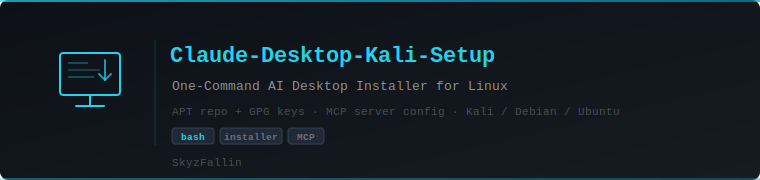

<p align="center">
  
</p>


# claude-desktop-kali-setup

One-command installer for Claude Desktop + MCP servers on Kali/Debian/Ubuntu.

**Author:** [SkyzFallin](https://github.com/SkyzFallin)

## What It Does

The install script:

- Adds the Claude Desktop APT repository and GPG key
- Installs `claude-desktop` and `mcp-kali-server`
- Configures MCP servers (filesystem + Kali MCP) in `~/.config/Claude/claude_desktop_config.json`

## Quick Start

```bash
git clone https://github.com/SkyzFallin/claude-desktop-kali-setup.git
cd claude-desktop-kali-setup
sudo ./install-claude-desktop.sh
```

## After Installation

1. Start the Kali API server: `kali-server-mcp`
2. Launch Claude Desktop: `claude-desktop`

## Sources

- [claude-desktop-debian](https://github.com/aaddrick/claude-desktop-debian) — Debian packaging for Claude Desktop
- [mcp-kali-server](https://www.kali.org/tools/mcp-kali-server/) — Kali MCP server for Claude

## License

MIT
